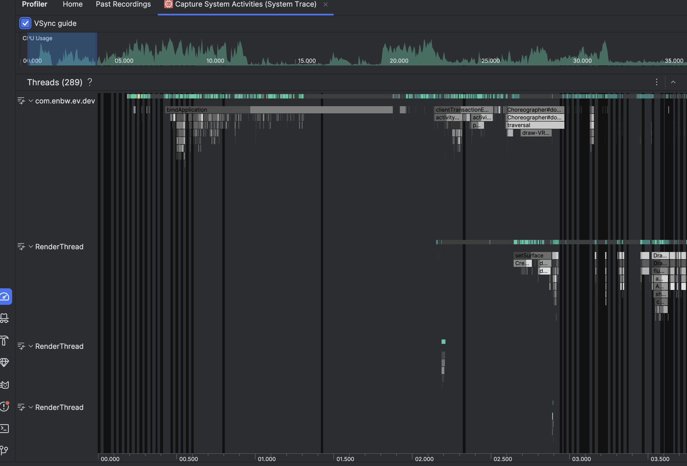

 Android CPU Profiler Kullanımı (Android): * Uygulamalarının CPU performansını izleyip optimize edebilmek için Android CPU Profiler aracını kullanmayı öğrenmelidir. Mentör’e Sunum ya da Yazı: * Bu araçların kullanımıyla ilgili mentöre bir sunum yapılmalı veya yazılı bir doküman hazırlanarak sunulmalıdır. Örnekleme çalışılan proje üzerinde yapılabilir.
## 1. Introduction to Android CPU Profiler
Android CPU profiler traces system calls and resource usage, we can observe how app processes are scheduled and run.
We can discover where the bottlenecks are and improve those areas for apps quality.
## 2. How to Use the CPU Profiler in Android Studio
### 2.1 Enabling the CPU Profiler
1. Open Android Studio and run your app on a physical device or emulator with **USB debugging enabled**.
2. Go to **View** → **Tool Windows** → **Profiler**
3. Select the running app process from the list.
4. Click on the **CPU tab** in the profiler window.
### 2.2 Selecting the Right Task Mode
We have green and red colored tasks here.
- Capture System Activities (System Trace)
- Analyze Memory Usage
- Find CPU Hotspot (Callstack sample)
- Track Memory Consumption (Java/Kotlin allocations)
- Find CPU Hotspot (Java/Kotlin method recording)
- Track Memory Consumption (Native allocations)
- View Live Telemetry

### 2.3 Running and Recording Traces
1. Click **Record** to begin capturing CPU activity.
2. Interact with your app to trigger performance-intensive tasks.
3. Click **Stop** to finish recording.
4. Analyze the **timeline view** with CPU activity, thread states, and function calls.

## 3. What is System Trace
A **system trace** in the Android Studio Profiler shows system-wide activity, helping you analyze how app processes run across CPU cores, how smoothly the UI renders, and power usage. 
Key visuals include;
- **CPU Usage** (tracks app CPU consumption) 
- **Interactions** (shows user events and lifecycle changes)
- **Display** (measures UI smoothness and frame rendering time)
- **Threads** (displays app and system threads). 
- **CPU Cores** (core activity per thread), 
- **Process Memory (RSS)** (app memory usage),
- **Power Rails** (device power consumption), and **Battery Usage**. 
By correlating these metrics, you can pinpoint performance bottlenecks like **UI jank, power spikes, or inefficient CPU use**.

### 3.1 Understanding System Trace
The **Trace View** in the CPU Profiler shows recorded trace data in different formats.
- **For method and function traces**, you can view:
	- **Call Chart** in the **Threads timeline**
	- **Flame Chart, Top Down, Bottom Up, and Events** in the **Analysis pane**
	- **Callstack frames** to see executed code and why it was invoked
- **For system traces**, you can view:    
    - **Trace Events** in the **Threads timeline**
    - **Flame Chart, Top Down, Bottom Up, and Events** in the **Analysis pane**

## 4. Debuggable vs. Profileable in Android

Both **debuggable** and **profileable** control how an app can be inspected, but they serve different purposes:

|Feature|**Debuggable**|**Profileable**|
|---|---|---|
|**Purpose**|Allows full debugging access|Allows limited profiling without full debugging|
|**Access**|Grants access to **all internals** of the app, including private data and breakpoints|Only allows performance profiling tools (e.g., CPU Profiler) to collect **execution traces**|
|**Security**|**Less secure**, should only be enabled for development|**More secure**, can be used in production builds for performance analysis|
|**Usage**|Used for **debugging, breakpoints, inspecting memory, modifying execution**|Used for **performance profiling (CPU, memory, rendering) without exposing app internals**|
|**Configuration**|Enabled by `android:debuggable="true"` in `AndroidManifest.xml` or `debuggable true` in `build.gradle`|Enabled by `android:profileable="true"` in `AndroidManifest.xml` (introduced in Android 10 - API 29)|

---

#### 4.1. When to Use Each?

- Use **debuggable** when developing and debugging an app locally.
- Use **profileable** when profiling app p
- erformance in a **release build** without exposing sensitive internals.

Would you like a practical example of how to enable **profileable** in your app?
## 5. Example
Here you can see the callstack when the app is opened first time;

